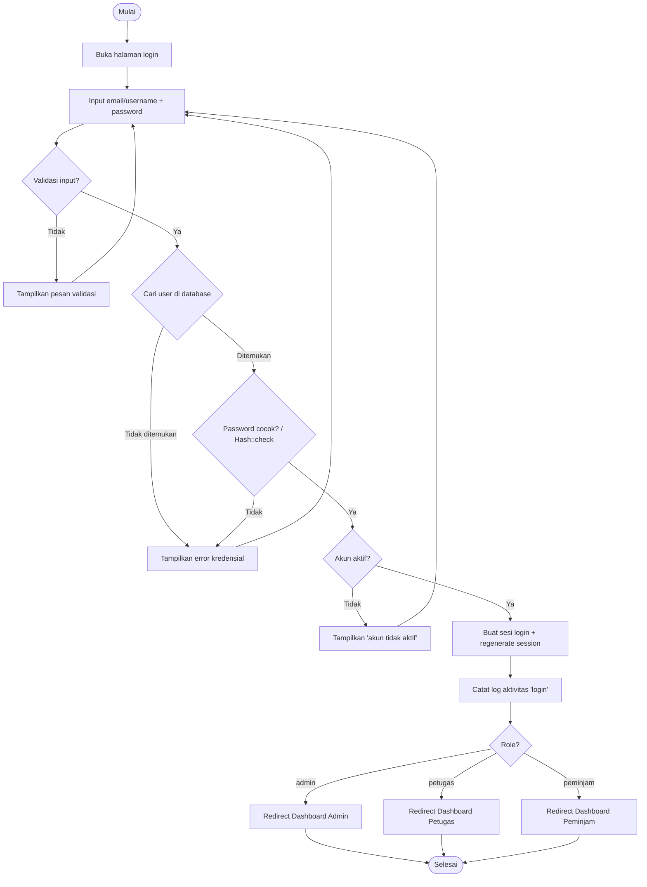

# Flowchart — Login

```mermaid
flowchart TD
    A([Mulai]) --> B[Buka halaman login]
    B --> C[Input email/username + password]
    C --> D{Validasi input?}
    D -- Tidak --> E[Tampilkan pesan validasi]
    E --> C
    D -- Ya --> F{Cari user di database}
    F -- Tidak ditemukan --> G[Tampilkan error kredensial]
    G --> C
    F -- Ditemukan --> H{Password cocok? / Hash::check}
    H -- Tidak --> G
    H -- Ya --> I{Akun aktif?}
    I -- Tidak --> J[Tampilkan 'akun tidak aktif']
    J --> C
    I -- Ya --> K[Buat sesi login + regenerate session]
    K --> L[Catat log aktivitas 'login']
    L --> M{Role?}
    M -- admin --> N[Redirect Dashboard Admin]
    M -- petugas --> O[Redirect Dashboard Petugas]
    M -- peminjam --> P[Redirect Dashboard Peminjam]
    N --> Z([Selesai])
    O --> Z
    P --> Z
```